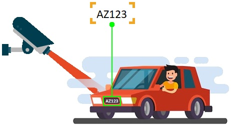

# **Automatic Number Plate Recognition**

## Intro
The project is an automatic number plate recognition program. It is made up of 3 modules:
 1. GUI -- Responsible for the program's interface and essentially is the main module running the program.
 2. LPD -- The module responsible for the license plate detection using image processing techniques.
 3. OCR -- The module which interfaces with the online OCR API.

This repo contains the code files of each of the modules along with license plate samples.

## Objectives
- Get a deeper understanding of image processing with OpenCV
- Experiment with GUI design
- Interface with an online API using Python
- Learn some basic usage of SQL

## ANPR Background
There are two main approaches to automatic number plate recognition:
- ANPR using classical image processing techniques
- ANPR using machine learning algorithms

In this project classical image processing techniques were employed.   
There are seven primary algorithms that an ANPR
  software requires for identifying a license plate:
  
1. Plate localization- responsible for finding and isolating the plate on the picture
2. Plate orientation and sizing – compensates for the skew of the plate and adjusts the dimensions to the required size
3. Normalization – adjusts the brightness and contrast of the image
4. Character segmentation – finds the individual characters on the plates
5. Optical character recognition
6. Syntactical/Geometrical analysis – check characters and positions against country-specific rules
7. The averaging of the recognised value over multiple fields/images to produce a more reliable or confident result,
   especially given that any single image may contain a reflected light flare,
   be partially obscured, or possess other obfuscating effects.
   
Since this project is not a commercial software, not all the algorithms listed here were employed, 
resulting in a relatively high error rate.

## Installation
These instructions will get you a copy of the project up and running on your local machine for development and testing purposes.
#### Requirements
This program was tested on Windows 10, 64 bit with Python 3.8 installed.
#### Step-by-Step Procedure
In order to set the virtual environment, installation of virtualenv platform is required.
Use the following commands to create a new working virtual environment with all the required dependencies.
```
git clone https://github.com/NoamSmilovich/Automatic-Number-Plate-Recognition.git
cd Automatic-Number-Plate-Recognition
python -m virtualenv .
.\Scripts\activate
pip install -r requirements.txt
GUI.py
```
After running these commands, the ANPR GUI should launch, there you will see instructions on how to use the program.
### Author
* **Noam Smilovich** - *noamsmi123@gmail.com*
